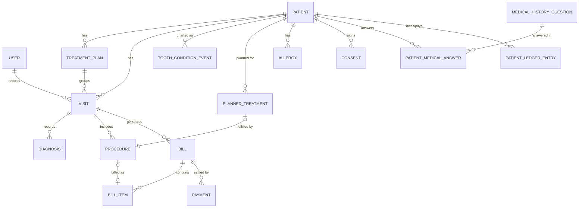

# Data Model

Expanded to cover roles, multi-visit treatment plans, a patient ledger, the
chart's condition-vs-planned split, structured intake/consent, and auditing.

> SQL Connect note: author schema fields in **camelCase** (no underscores);
> SQL Connect maps them to snake_case Postgres columns. Snake_case below is the
> conceptual column name. IDs are `UUID`. See `tech-architecture.md`.

## Core entities

### USER (app/staff account)
`id` · `auth_uid` (Firebase) · `display_name` · `role` (dentist | staff) ·
`active`. Role also set as a Firebase custom claim.

### PATIENT
`id` · `name` · `date_of_birth` · `sex` · `contact` · `address` ·
`guardian_name` / `guardian_contact` (minors) · `is_senior` · `is_pwd` ·
`sc_pwd_id_number` · `tin` · `registered_at`. Allergies, medical history, and
consent are separate structured records (below).

### MEDICAL_HISTORY_QUESTION  /  PATIENT_MEDICAL_ANSWER
Configurable questionnaire. Question template + per-patient answers keyed to it.
See `patient-record-and-consent.md`.

### ALLERGY
`id` · `patient_id` · `substance` · `severity` · `note`. Structured and surfaced
prominently (anesthesia safety).

### CONSENT
`id` · `patient_id` · `type` (treatment | radiograph | extraction | data_privacy)
· `acknowledged_at` · `acknowledged_by` · `text_version`.

### TREATMENT_PLAN (case)
`id` · `patient_id` · `title` · `status` (active | completed | cancelled) ·
`created_at`. Groups multi-visit treatments.

### VISIT (Encounter)
`id` · `patient_id` · `treatment_plan_id` (nullable) · `visit_date` ·
`chief_complaint` · `notes` · `created_by`.

### DIAGNOSIS
`id` · `visit_id` · `tooth_ref` (FDI code) · `description` · `created_at` ·
`created_by`.

### TOOTH_CONDITION_EVENT (the dental chart — append-only)
`id` · `patient_id` · `tooth_number` (FDI string) · `condition_code` · `note` ·
`recorded_at` · `recorded_by`. **Current condition = latest event per tooth**
(optionally cached). Append-only gives full per-tooth history. Primary vs.
permanent is derivable from the FDI code.

### PLANNED_TREATMENT (the "P" overlay — separate from current condition)
`id` · `patient_id` · `tooth_number` (nullable FDI) · `description` ·
`status` (planned | done | cancelled) · `linked_procedure_id` (nullable) ·
`created_at`. A tooth can have a current condition **and** one or more planned
treatments at the same time (see `dental-chart-pda-spec.md`).

### PROCEDURE
`id` · `visit_id` · `planned_treatment_id` (nullable) · `type` ·
`tooth_ref` (FDI) · `base_price` · `notes` · `performed_by`.

### BILL
`id` · `visit_id` (nullable) · `treatment_plan_id` (nullable) · `status`
(draft | finalized | paid | void) · `discount_type` · `discount_pct` ·
`vat_exempt` · `vat_rate` · `sc_pwd_id_snapshot`. `subtotal` / `discount_amount`
/ `vat_amount` / `grand_total` are **computed** from line items, not stored
independently.

### BILL_ITEM
`id` · `bill_id` · `procedure_id` (**nullable** — lines need not be procedures) ·
`description` · `quantity` · `unit_price` (editable) · `line_total`.

### PATIENT_LEDGER_ENTRY
`id` · `patient_id` · `type` (charge | payment | refund | writeoff | adjustment)
· `amount` · `bill_id` (nullable) · `recorded_at` · `recorded_by`. Patient
**balance** = sum of charges − sum of payments/credits.

### PAYMENT
`id` · `patient_id` · `bill_id` (nullable) · `amount` · `method` · `paid_at` ·
`recorded_by`. Supports partial/installment payments. (Recorded as a ledger
entry too.)

### INSTALLMENT_SCHEDULE (optional)
`id` · `treatment_plan_id` or `patient_id` · `due_date` · `amount_due` ·
`status`.

### AUDIT_LOG
`id` · `user_id` · `action` · `entity` · `entity_id` · `at`. Required now that
multiple users sign in. No hard deletes — use status/void + versioned edits.

## Key relationships
- USER 1—* (VISIT, PROCEDURE, ledger entries) via `*_by` fields
- PATIENT 1—* TREATMENT_PLAN, VISIT, TOOTH_CONDITION_EVENT, PLANNED_TREATMENT,
  ALLERGY, CONSENT, PATIENT_MEDICAL_ANSWER, PATIENT_LEDGER_ENTRY, PAYMENT
- TREATMENT_PLAN 1—* VISIT
- VISIT 1—* DIAGNOSIS, PROCEDURE
- VISIT 1—* BILL (was 1—1; relaxed for plan-level billing)
- PLANNED_TREATMENT 0..1—1 PROCEDURE (a procedure may fulfill a planned item)
- BILL 1—* BILL_ITEM, PAYMENT
- BILL_ITEM 0..1—1 PROCEDURE (line may or may not map to a procedure)

## ERD source (Mermaid, core relationships)

## Standardization
- All tooth references (`tooth_number`, `tooth_ref`) use the **FDI two-digit
  code as a string**, consistently across chart, diagnosis, procedure, and
  planned treatment.

## Open data decisions
- BILL scope: per-visit vs. per-treatment-plan (modeled to allow both).
- Whether installment schedule ships v1 or later.
- Cache strategy for "current tooth condition" derived from the event log.
