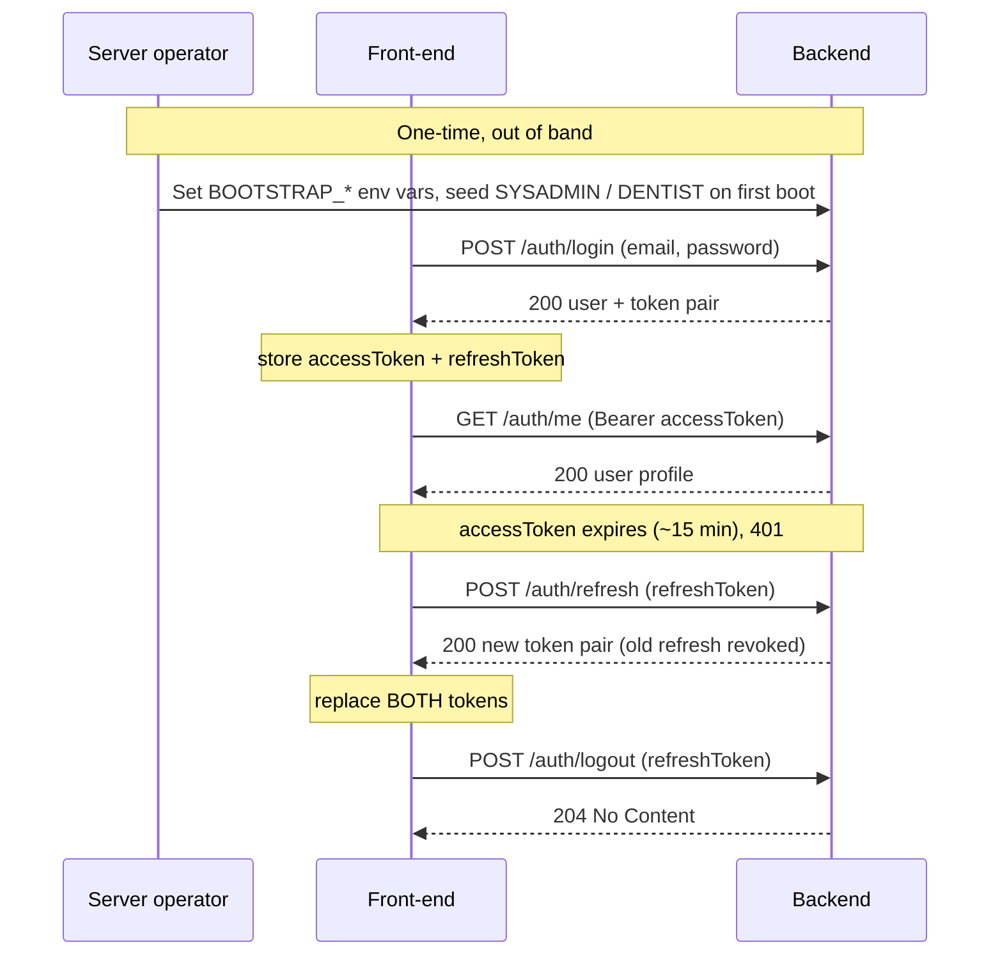

# API Contracts

Integration contracts for the Dental PMS backend, written for the **front-end /
API-integration engineer**. Each file describes one feature module: its endpoints, the
exact request/response JSON, the error cases, and — importantly — the **order** in which
the calls must be made.

These are hand-written companions to the live, code-generated OpenAPI spec:

- **OpenAPI 3 spec:** `GET /api.json`
- **Swagger UI (interactive):** `GET /swagger` — use the **Authorize** button to paste a bearer token and try protected calls.

The spec is the machine-readable source of truth for schemas; these documents add the
call sequences, field-level notes, and gotchas a raw schema can't express. If a detail
here ever disagrees with `/api.json`, the running spec wins.

## Contracts by module

| Module | File | Status |
|--------|------|--------|
| Authentication | [auth.md](auth.md) | Available |
| System / health | [system.md](system.md) | Available |

> **Naming convention.** One file per feature/module, named `<module>.md` (lowercase,
> kebab-case if multi-word). As new modules ship (patients, visits, dental chart,
> billing, …) add a `<module>.md` here and a row to the table above. Only
> currently-built endpoints are documented; planned modules live in the
> [functional spec](../project-overview.md) until they exist.

## Global conventions

These apply to **every** module unless a contract says otherwise.

### Base URL

The server binds `SERVER_HOST` (default `0.0.0.0`) on `PORT` (default `8080`):

```
http://<host>:8080
```

Examples below use `http://localhost:8080`.

### Content type & encoding

- Requests and responses are **`application/json`** (`Content-Type: application/json`).
- Field names are **camelCase, exactly as shown** — there is no snake_case conversion.
- `id` values are UUID **strings**; there are no custom date/UUID wire formats.

### Authentication

Protected routes require a bearer access token:

```
Authorization: Bearer <accessToken>
```

Tokens come from `POST /auth/login` (see [auth.md](auth.md)). The access token is
short-lived; use `POST /auth/refresh` to get a new one without re-entering credentials.

| Token | Lifetime (default) | Configurable via | Notes |
|-------|--------------------|------------------|-------|
| Access token | **15 min** (`expiresIn: 900`) | `ACCESS_TOKEN_TTL_MINUTES` | Stateless JWT (HMAC-SHA256). Carries the user's `role`. |
| Refresh token | **14 days** | `REFRESH_TOKEN_TTL_DAYS` | Opaque, server-side, **single-use / rotating**. |

### Roles

Every authenticated user has exactly one role, sent as a wire string:

- `SYSADMIN` — owns data / system configuration (its own endpoints are not built yet).
- `DENTIST` — all clinical & billing operations.

### Error format

Every non-2xx response that has a body uses one envelope:

```json
{ "error": "machine_readable_code", "message": "Human-readable explanation" }
```

Branch on the stable `error` code, not on the `message` text. `204 No Content`
responses (e.g. logout) have **no body**.

## The end-to-end sequence

The correct lifecycle a client follows, across modules:

1. **(Server operator, one-time — not an API call.)** On first boot with an empty user
   table, the backend seeds the initial `SYSADMIN` / `DENTIST` accounts from
   `BOOTSTRAP_*` environment variables. There is **no signup endpoint** — the front-end
   never creates the first accounts; it receives credentials out of band.
2. **Log in** — `POST /auth/login` with email + password. Persist both the
   `accessToken` and the `refreshToken`.
3. **Call protected endpoints** — send `Authorization: Bearer <accessToken>` (e.g.
   `GET /auth/me`).
4. **Refresh** — when a protected call returns `401`, or shortly before the access token
   expires, call `POST /auth/refresh` with the stored refresh token. It returns a **new
   pair**; overwrite **both** stored tokens (the old refresh token is now dead).
5. **Log out** — `POST /auth/logout` with the refresh token to revoke it (`204`).



### Recommended token-refresh strategy

- On any `401` from a protected route, attempt **one** `POST /auth/refresh`, then retry
  the original request with the new access token.
- If the refresh itself returns `401`, the session is over — clear the stored tokens and
  send the user back to login.
- Because refresh **rotates**, never fire two refreshes concurrently with the same token
  — the second will fail. Serialize refreshes (single-flight).

## See also

- [access-control-and-roles.md](../access-control-and-roles.md) — roles and enforcement rationale.
- [project-overview.md](../project-overview.md) — product scope and the full doc index.
