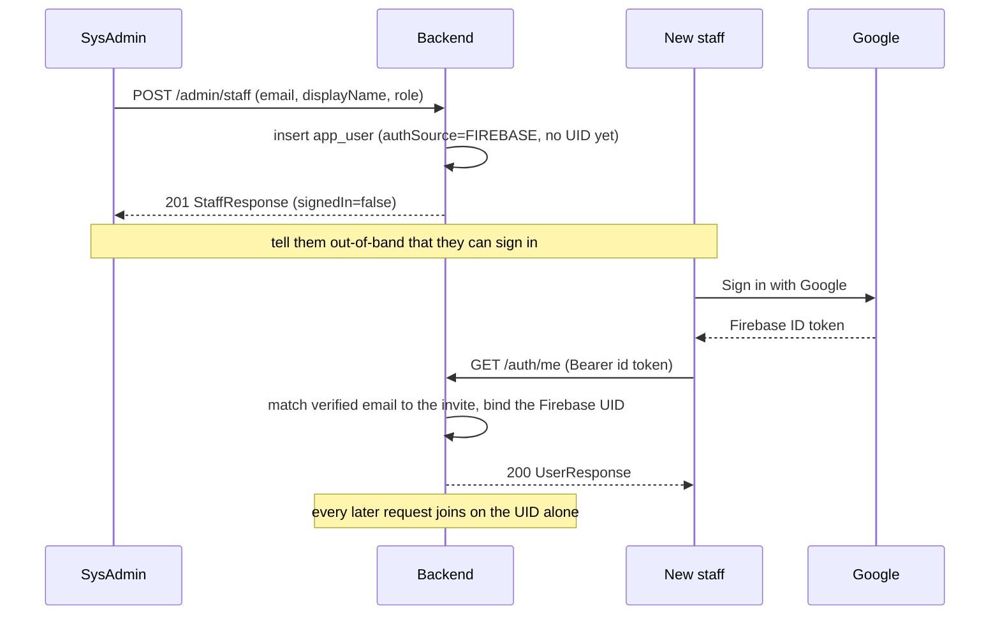

# Staff Admin API

Provisioning and lifecycle management for staff accounts. Base path: **`/admin/staff`**.

Every endpoint requires the **`SYSADMIN`** role (either a Firebase SysAdmin or the LOCAL
break-glass account) — send `Authorization: Bearer <token>`. See [README.md](README.md)
for global conventions and [auth.md](auth.md) for how the two credential types work.

## How staff onboarding works

Staff **do not self-register**. A SysAdmin creates the account — an **invitation** naming an
email and a role — and the staff member claims it the first time they press "Sign in with
Google" with that exact address.

The backend never talks to Firebase. It verifies ID tokens against Google's public keys and
holds no service-account credentials, so it cannot create, disable or look up Firebase users.
Provisioning is purely a Neon write, and the Google identity attaches itself on first contact.



Two things follow from this that are easy to trip over:

- **The email must match exactly.** It is the only thing tying the invitation to a Google
  account. An address that differs from the one they sign in with gets a `401` that no amount
  of retrying will fix.
- **Nobody is notified.** There is no invitation email — telling the staff member they can
  sign in is an out-of-band conversation. `signedIn` on the account tells you whether they
  have actually done it.

## Endpoints

| Method & path | Purpose | Success |
|---------------|---------|---------|
| `POST /admin/staff` | Invite a Google-authenticated staff member | `201 Created` |
| `GET /admin/staff` | List staff accounts | `200 OK` |
| `GET /admin/staff/{id}` | Get one staff account | `200 OK` |
| `POST /admin/staff/{id}/deactivate` | Offboard (block access) | `204 No Content` |
| `POST /admin/staff/{id}/reactivate` | Re-enable | `204 No Content` |

---

## POST /admin/staff

Invite a Google-authenticated staff member. Requires `SYSADMIN`.

**Request** — `ProvisionStaffRequest`

| Field | Type | Required | Notes |
|-------|------|----------|-------|
| `email` | string | yes | Trimmed + lowercased. Must contain `@` and be at most **320** characters after trimming. **Must be exactly the address of the Google account they will sign in with** — it is what binds them to this account. |
| `displayName` | string | yes | Trimmed; at most **200** characters after trimming, and not blank. Shown in the UI / on the account. |
| `role` | string | yes | `SYSADMIN` or `DENTIST`. |

The two length caps match the underlying columns, so an over-long value is a `400` rather than
a failed insert.

```json
POST /admin/staff
Authorization: Bearer <sysadmin token>
Content-Type: application/json

{ "email": "dentist@clinic.example", "displayName": "Dr. Cruz", "role": "DENTIST" }
```

**Side effects.** One row in Neon. Nothing is created in Firebase and **no email is sent** —
telling the staff member they can now sign in is up to you. **No password is returned or
accepted**; there is no password in this flow at all.

**`201 Created`** — `StaffResponse`

```json
{
  "id": "6f9619ff-8b86-d011-b42d-00cf4fc964ff",
  "email": "dentist@clinic.example",
  "displayName": "Dr. Cruz",
  "role": "DENTIST",
  "active": true,
  "authSource": "FIREBASE",
  "signedIn": false
}
```

`signedIn` is `false` until they complete their first Google sign-in; it never goes back to
`false` afterwards, not even across a deactivate/reactivate.

> **Idempotent.** Inviting an email that already has a Firebase staff account returns
> `409 already_provisioned` (a no-op) — whether or not that account has been claimed yet.

**Errors**

| Status | `error` | When |
|--------|---------|------|
| `400 Bad Request` | `invalid_request` | Missing/blank fields, malformed email, an `email` over 320 or `displayName` over 200 characters, or an unknown role. |
| `401 Unauthorized` | `unauthorized` | Missing or invalid token. |
| `403 Forbidden` | `forbidden` | The caller is not a `SYSADMIN`. |
| `409 Conflict` | `already_provisioned` | The email is already a Firebase staff account. |
| `409 Conflict` | `local_account_exists` | The email belongs to a LOCAL break-glass account (never converted). |

---

## GET /admin/staff

List staff accounts (from Neon, the source of truth). Requires `SYSADMIN`.

**Query parameters**

| Param | Type | Notes |
|-------|------|-------|
| `active` | boolean | Optional. `true` → active only, `false` → inactive only, omitted → all. Any other value is a `400`, not a silent "all". |

```
GET /admin/staff?active=true
Authorization: Bearer <sysadmin token>
```

**`200 OK`** — array of `StaffResponse`

```json
[
  { "id": "…", "email": "dentist@clinic.example", "displayName": "Dr. Cruz",
    "role": "DENTIST", "active": true, "authSource": "FIREBASE", "signedIn": true },
  { "id": "…", "email": "newhire@clinic.example", "displayName": "Dr. Santos",
    "role": "DENTIST", "active": true, "authSource": "FIREBASE", "signedIn": false },
  { "id": "…", "email": "admin@clinic.example", "displayName": "Clinic Admin",
    "role": "SYSADMIN", "active": true, "authSource": "LOCAL", "signedIn": true }
]
```

**Errors**

| Status | `error` | When |
|--------|---------|------|
| `400 Bad Request` | `invalid_request` | `active` was supplied but is not `true` or `false`. |

---

## GET /admin/staff/{id}

Get a single staff account by id. Requires `SYSADMIN`.

**`200 OK`** — `StaffResponse` (as above).

**Errors**

| Status | `error` | When |
|--------|---------|------|
| `404 Not Found` | `not_found` | No staff account with that id (or a malformed id). |

---

## POST /admin/staff/{id}/deactivate

Offboard a staff member: sets `active = false` in Neon **immediately**, blocking all access
on the next request regardless of any still-valid token. Requires `SYSADMIN`.

That single flag **is** the revocation — role and active status are read from the database on
every request. Their Google account keeps existing and can still sign in to Google; it simply
reaches nothing here. The backend cannot disable the Firebase user itself (that needs
credentials it deliberately does not hold), and does not need to.

**`204 No Content`** — no body.

**Errors**

| Status | `error` | When |
|--------|---------|------|
| `404 Not Found` | `not_found` | No staff account with that id. |

---

## POST /admin/staff/{id}/reactivate

Re-enable a previously deactivated staff member (Neon `active = true`). Requires `SYSADMIN`.
If they had already claimed their invite, their existing Google identity still maps to this
account — they do not sign in again from scratch.

**`204 No Content`** — no body. `404 not_found` if there is no such account.

---

## Data types

DTOs defined in `src/admin/StaffDtos.kt`. Fields are required and non-null on the wire.

### `ProvisionStaffRequest`

| Field | Type |
|-------|------|
| `email` | string |
| `displayName` | string |
| `role` | string (`SYSADMIN` \| `DENTIST`) |

### `StaffResponse`

| Field | Type | Notes |
|-------|------|-------|
| `id` | string | Neon `app_user` id (UUID). |
| `email` | string | |
| `displayName` | string | |
| `role` | string | `SYSADMIN` or `DENTIST`. |
| `active` | boolean | False once offboarded. |
| `authSource` | string | `FIREBASE` for invited staff, `LOCAL` for the break-glass account. The internal `firebaseUid` is never exposed. |
| `signedIn` | boolean | False while a Firebase invite is unclaimed — the account exists but nobody has signed in with Google as this email yet. Always true for a LOCAL account. |

## See also

- [auth.md](auth.md) — the two credential types and the break-glass login lifecycle.
- [access-control-and-roles.md](../overview/access-control-and-roles.md) — role model & enforcement.
