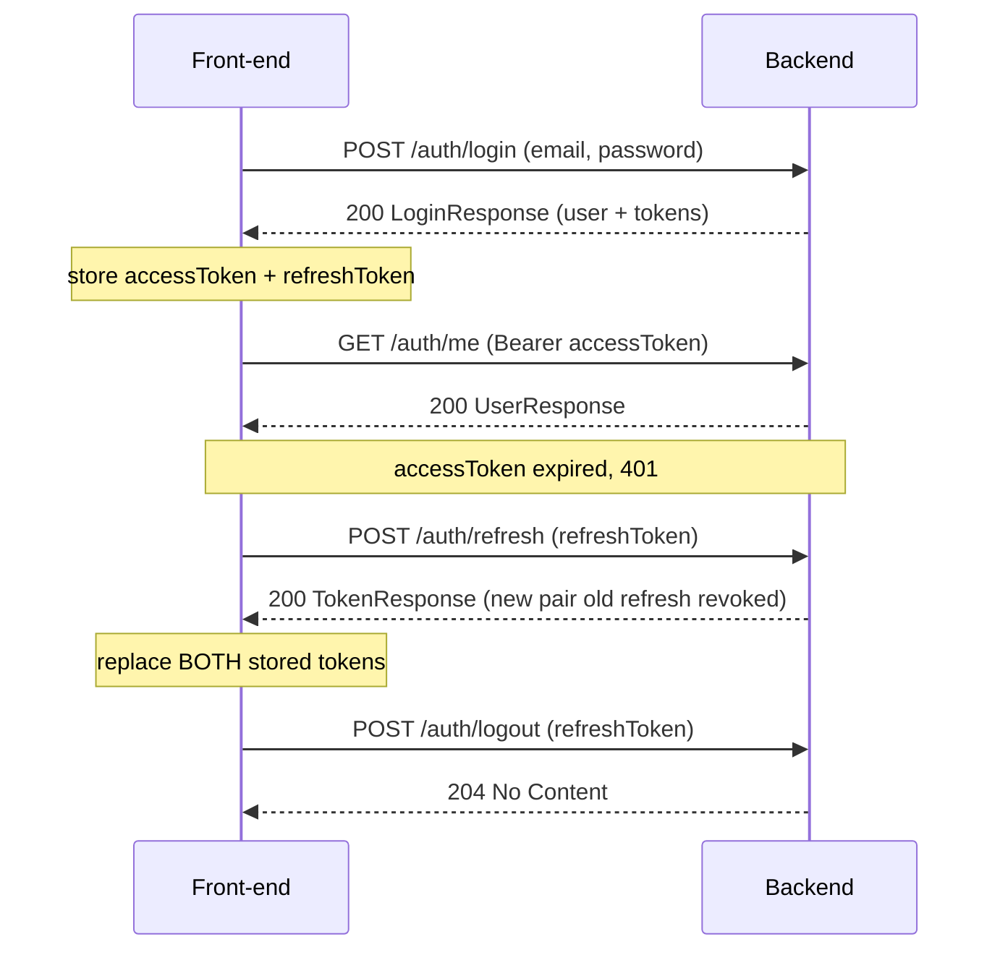

# Auth API

Authentication and session management. Base path: **`/auth`**.

All endpoints exchange JSON. See [README.md](README.md) for global conventions (base URL,
error envelope, token lifetimes, roles).

## Two ways to authenticate

Staff and the break-glass admin reach the same protected API with different credentials.
The backend accepts either as `Authorization: Bearer <token>` and always resolves **role
and active status from the database**, never from the token:

- **Firebase staff (the normal path).** One **"Sign in with Google"** button. Staff sign in
  with the **Firebase Web SDK** and send the resulting **Firebase ID token**. There is **no
  backend login endpoint** for them — the `POST /auth/{login,refresh,logout}` endpoints below
  do not apply. Staff accounts are created by a SysAdmin via
  [admin-staff.md](admin-staff.md).
- **LOCAL break-glass account.** A self-hosted email + password account (seeded from env —
  see [Bootstrap](#bootstrap--how-accounts-are-created)) that works even when Firebase is
  unavailable. It uses `POST /auth/login` → `/auth/refresh` → `/auth/logout` below. This is
  the always-available way in for the clinic; keep it to a single SysAdmin.

Either credential works on `GET /auth/me` and on every role-guarded route.

## Signing in with Google (front-end contract)

The whole flow is client-side. The backend has no Google endpoint, no redirect handler and
no OAuth callback — it only ever receives an ID token on a normal API call.

**1. Configure the Firebase Web SDK.** The config object (`apiKey`, `authDomain`,
`projectId`, …) is **public** and belongs in the client repo. There is no
`google-services.json` — that is an Android artifact — and no service-account key anywhere;
the backend verifies tokens against Google's public keys and holds no Firebase credentials
at all.

**2. One button.**

```js
import { getAuth, GoogleAuthProvider, signInWithPopup } from "firebase/auth";

const { user } = await signInWithPopup(getAuth(), new GoogleAuthProvider());
const idToken = await user.getIdToken();
```

**3. Send the token on every request**, exactly like the LOCAL access token:

```
GET /auth/me
Authorization: Bearer <firebase id token>
```

Call `getIdToken()` before each request (or per batch) — the SDK returns the cached token and
refreshes it only when it is close to expiring. Do not cache it yourself for more than an hour.

**4. First sign-in.** A staff account must already have been created by a SysAdmin with
**exactly** the email of the Google account being used (see
[admin-staff.md](admin-staff.md)). The first successful call permanently binds that Google
identity to the account. A `401` on a brand-new user means either no account was created for
that address or the addresses do not match — it is not retryable, and the fix is an admin
action, not a client one.

### What a Firebase ID token must satisfy

Being signed by Google is not enough. Beyond the signature, issuer, audience and expiry
checks, the backend also requires all of the following. A token failing **any** of them is
rejected exactly like a forged one — a `401` with the standard body below, with no indication
of which rule failed. The reason is written to the server log against the Firebase UID.

| Requirement | Default | Notes |
|---|---|---|
| `email_verified` is true | required | Google always asserts this for its own accounts, so it is free in practice. Configurable via `FIREBASE_REQUIRE_VERIFIED_EMAIL`. |
| `firebase.sign_in_provider` is on the allowlist | `google.com` | Only Google sign-in. Anonymous, phone, password and custom-token sign-ins are refused even if enabled on the Firebase project. |
| `auth_time` is within the max session age | 12 hours | `FIREBASE_MAX_SESSION_AGE_HOURS`; `0` disables it. |
| A matching **active** `app_user` account exists | always | There is no auto-provisioning; see [admin-staff.md](admin-staff.md). |

A missing claim is a rejection, not a pass.

> ### Session age needs a sign-out, not a refresh
>
> A Firebase ID token lives about an hour and the SDK refreshes it silently and indefinitely —
> but `auth_time` records when the user *actually signed in* and does not move on a refresh.
> Once a sign-in passes the max session age, every request 401s and **`getIdToken(true)` will
> not fix it**.
>
> So a client that reacts to `401` by force-refreshing the token and retrying will loop
> forever. On a `401` that survives one refresh, call `signOut()` and send the user back
> through `signInWithPopup`.

## The break-glass login lifecycle (LOCAL account)

This email/password lifecycle applies **only to the LOCAL break-glass account**. Firebase
staff sign in with Google and refresh through the Firebase Web SDK instead.



1. **Log in** with email + password → store the returned `accessToken` and `refreshToken`.
2. **Use** `accessToken` as `Authorization: Bearer <accessToken>` on protected routes.
3. **Refresh** with `refreshToken` when the access token nears/reaches expiry; store the
   **new** pair (the old refresh token is immediately revoked).
4. **Log out** with `refreshToken` to end the session.

> **No signup endpoint.** Accounts are provisioned server-side (see
> [Bootstrap](#bootstrap--how-accounts-are-created) below). There is no
> `POST /auth/register`.

---

## POST /auth/login

Exchange email + password for a user profile and a token pair. Public — **LOCAL
break-glass account only**; Firebase staff never call this.

**Request** — `LoginRequest`

| Field | Type | Required | Notes |
|-------|------|----------|-------|
| `email` | string | yes | Case-insensitive; trimmed + lowercased server-side. |
| `password` | string | yes | Sent in the body over TLS; verified against a bcrypt hash. |

```json
POST /auth/login
Content-Type: application/json

{ "email": "dentist@example.com", "password": "s3cret-passphrase" }
```

**`200 OK`** — `LoginResponse`

| Field | Type | Notes |
|-------|------|-------|
| `user` | `UserResponse` | The authenticated user (see [Data types](#data-types)). |
| `tokens` | `TokenResponse` | Access + refresh token pair. |

```json
{
  "user": {
    "id": "6f9619ff-8b86-d011-b42d-00cf4fc964ff",
    "email": "dentist@example.com",
    "displayName": "Dr. Reyes",
    "role": "DENTIST"
  },
  "tokens": {
    "accessToken": "eyJhbGciOiJIUzI1NiIsInR5cCI6IkpXVCJ9.eyJ...<jwt>",
    "refreshToken": "gH7s...<opaque-random>",
    "expiresIn": 900
  }
}
```

> **`tokenType` is omitted from the JSON.** `TokenResponse` has a `tokenType` field that
> always equals `"Bearer"`, but the server does not serialize default values, so the
> field is **absent from the response**. Treat the token type as `"Bearer"`
> unconditionally — do not read `tokens.tokenType`.

**Errors**

| Status | `error` | When |
|--------|---------|------|
| `401 Unauthorized` | `invalid_credentials` | Unknown email **or** wrong password — deliberately indistinguishable. |
| `403 Forbidden` | `inactive_account` | Credentials were correct but the account is deactivated. |

---

## POST /auth/refresh

Rotate a valid refresh token for a brand-new token pair. Public (the refresh token is
the credential) — **LOCAL break-glass account only**. Firebase staff refresh via the
Firebase Web SDK.

**Request** — `RefreshRequest`

| Field | Type | Required | Notes |
|-------|------|----------|-------|
| `refreshToken` | string | yes | The opaque refresh token from the last login/refresh. |

```json
POST /auth/refresh
Content-Type: application/json

{ "refreshToken": "gH7s...<opaque-random>" }
```

**`200 OK`** — `TokenResponse` (a **new** pair)

```json
{
  "accessToken": "eyJ...<new-jwt>",
  "refreshToken": "kP2m...<new-opaque-random>",
  "expiresIn": 900
}
```

> **Rotation — single use.** The refresh token you send is **revoked** the moment it is
> accepted, and a **new** one is returned. Always persist the new `refreshToken`; the old
> one will never work again. Don't refresh the same token twice — serialize concurrent
> refreshes (single-flight).

**Errors**

| Status | `error` | When |
|--------|---------|------|
| `401 Unauthorized` | `invalid_refresh_token` | Token is unknown, malformed, expired, or already used/revoked. |
| `403 Forbidden` | `inactive_account` | The owning account has been deactivated. |

---

## POST /auth/logout

Revoke a refresh token. Public and **idempotent** — **LOCAL break-glass account only**.

**Request** — `LogoutRequest`

| Field | Type | Required | Notes |
|-------|------|----------|-------|
| `refreshToken` | string | yes | The refresh token to revoke. |

```json
POST /auth/logout
Content-Type: application/json

{ "refreshToken": "kP2m...<opaque-random>" }
```

**`204 No Content`** — no response body. Returned whether or not the token existed, so
logout is safe to call blindly.

> Logout revokes the **refresh** token only. The access token is a stateless JWT and is
> **not** tracked server-side — it stays valid until its own `exp` (≤ 15 min). For an
> immediate hard sign-out, also discard the access token on the client.

---

## GET /auth/me

Return the profile of the authenticated user. **Requires a bearer token** (any role) —
either a LOCAL access token or a **Firebase ID token**.

**Request** — no body:

```
GET /auth/me
Authorization: Bearer <accessToken or firebase-id-token>
```

**`200 OK`** — `UserResponse`

```json
{
  "id": "6f9619ff-8b86-d011-b42d-00cf4fc964ff",
  "email": "dentist@example.com",
  "displayName": "Dr. Reyes",
  "role": "DENTIST"
}
```

**Errors**

| Status | `error` | `message` | When |
|--------|---------|-----------|------|
| `401 Unauthorized` | `unauthorized` | `Missing or invalid token` | No token; a malformed / expired / wrong-issuer token; a Firebase token with **no provisioned local account**; an account that has been **deactivated**; or a Firebase token that fails any rule in [What a Firebase ID token must satisfy](#what-a-firebase-id-token-must-satisfy) — unverified email, a sign-in provider outside the allowlist, or a sign-in older than the max session age. |

> All of these produce the **same** status, `error` code and `message`. That is deliberate:
> a distinguishable response would let anyone holding a token probe which rule they tripped.
> Diagnose from the server log, which records the Firebase UID and the specific reason.

> **Deactivation is instant.** Role and active status are read from the database on every
> request, so deactivating an account (see [admin-staff.md](admin-staff.md)) rejects it
> immediately — regardless of any still-valid token's remaining lifetime.

---

## Data types

All auth DTOs (defined in `src/auth/AuthDtos.kt`). Every field is **required and
non-null** on the wire unless noted.

### `LoginRequest`

| Field | Type |
|-------|------|
| `email` | string |
| `password` | string |

### `RefreshRequest` / `LogoutRequest`

| Field | Type |
|-------|------|
| `refreshToken` | string |

### `TokenResponse`

| Field | Type | Notes |
|-------|------|-------|
| `accessToken` | string | JWT (HMAC-SHA256). Send as `Authorization: Bearer`. |
| `refreshToken` | string | Opaque random string; single-use. |
| `expiresIn` | number | **Access-token** lifetime in **seconds** (default `900`). |
| `tokenType` | string | Always `"Bearer"` — **omitted from the JSON** (see the login note). |

### `UserResponse`

| Field | Type | Notes |
|-------|------|-------|
| `id` | string | UUID. |
| `email` | string | |
| `displayName` | string | |
| `role` | string | `SYSADMIN` or `DENTIST`. |

### `LoginResponse`

| Field | Type |
|-------|------|
| `user` | `UserResponse` |
| `tokens` | `TokenResponse` |

### `ErrorResponse`

| Field | Type | Notes |
|-------|------|-------|
| `error` | string | Stable machine code — branch on this. |
| `message` | string | Human-readable; may change. |

## The access token (JWT)

This applies to the **LOCAL** access token from `POST /auth/login`. **The front-end should
treat it as opaque** and use `GET /auth/me` for user info rather than decoding it; the
claims are listed only for troubleshooting.

> The `role` claim is **advisory only**. The backend re-reads role and active status from
> the database on every request, so changing a role or deactivating an account takes effect
> immediately without waiting for the token to expire.

| Claim | Meaning |
|-------|---------|
| `sub` | User id (UUID string). |
| `role` | `SYSADMIN` or `DENTIST`. |
| `email` | User email. |
| `name` | Display name. |
| `iss` / `aud` | Issuer / audience (default `dental-pms` / `dental-pms-web`). |
| `iat` / `exp` | Issued-at / expiry (epoch seconds). |

## Bootstrap — how accounts are created

There is no registration API. On first boot **with an empty user table**, the server
seeds the initial **LOCAL** accounts from environment variables (a server-operator
concern, not a client call):

| Role | Env vars | Notes |
|------|----------|-------|
| `SYSADMIN` | `BOOTSTRAP_SYSADMIN_EMAIL`, `BOOTSTRAP_SYSADMIN_PASSWORD`, `BOOTSTRAP_SYSADMIN_NAME` | Seeded only if email **and** password are set; `NAME` optional (defaults to the role name). |
| `DENTIST` | `BOOTSTRAP_DENTIST_EMAIL`, `BOOTSTRAP_DENTIST_PASSWORD`, `BOOTSTRAP_DENTIST_NAME` | Same rules. |

These are **LOCAL** (`authSource = LOCAL`) break-glass accounts — the always-available way
in when Firebase is unavailable. Bootstrap is idempotent (a restart with existing users
does nothing). Ongoing **Firebase staff** are then provisioned by a SysAdmin through
[admin-staff.md](admin-staff.md), not seeded here. See
[access-control-and-roles.md](../access-control-and-roles.md).

## See also

- [admin-staff.md](admin-staff.md) — provisioning and lifecycle of Firebase staff accounts.
- [system.md](system.md) — health & discovery endpoints.
- [access-control-and-roles.md](../access-control-and-roles.md) — role model & enforcement.
