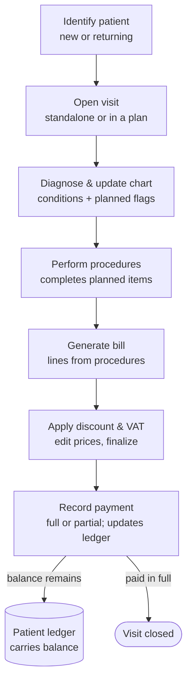

# Visit Flow

End-to-end flow for a single visit, from identifying the patient through
charting, procedures, billing (with discounts/VAT), and payment into the ledger.
Cross-references: `clinical-workflow.md`, `data-model.md`,
`dental-chart-pda-spec.md`, `billing-and-payments.md`,
`patient-record-and-consent.md`, `access-control-and-roles.md`.

## Actors
- **Dentist** — performs every step below (full access); the only actor in the
  clinical workflow.
- **SysAdmin** — manages accounts and configuration; not part of the visit flow.

## Preconditions
- User is authenticated (JWT); the **Dentist** role is required to perform the flow.
- Every create/edit is attributed to the acting user and audit-logged.

---

## Stage 1 — Identify patient
**New patient** → create `PATIENT` + structured intake: allergies, configurable
medical history, consent (treatment + data-privacy), and senior/PWD + TIN fields
if applicable. See `patient-record-and-consent.md`.

**Returning patient** → search and open the record. Review the visit timeline,
dental chart, and previous diagnoses to judge follow-up vs. new complaint.

> Allergy alerts (esp. anesthetic) surface prominently here and again before any
> procedure.

## Stage 2 — Open visit
Create a `VISIT` (date, chief complaint, notes), attributed to the dentist.
- **Standalone** visit, or
- **Part of a treatment plan** — link to a new or existing `TREATMENT_PLAN` when
  the case spans multiple appointments (e.g. impacted wisdom tooth removal). The
  plan groups visits, procedures, and charges, and the patient balance carries
  across them via the ledger.

## Stage 3 — Diagnose & update the chart
- Record `DIAGNOSIS` entries (optionally tied to a tooth via FDI code).
- Update the PDA chart: each change is a new `TOOTH_CONDITION_EVENT`
  (append-only; latest = current condition).
- Flag intended work as `PLANNED_TREATMENT` (the `P` overlay). A tooth keeps its
  current condition **and** its planned flag(s) simultaneously — e.g. a crowned
  tooth (`C`) flagged for a root canal.

## Stage 4 — Perform procedures
- The procedure screen can **pre-populate candidates from teeth flagged `P`**
  (the planned-treatment → procedure bridge).
- Each completed procedure becomes a `PROCEDURE` (linked to its
  `planned_treatment_id` when it fulfills one).
- Completing a procedure **updates the chart**: a new `TOOTH_CONDITION_EVENT`
  for the new state (e.g. `F`/`C`/`X`) and the planned item is marked `done`.
- Not every procedure is billable (warranty redo, free post-op check) — billing
  is decided in the next stage, not forced here.

## Stage 5 — Generate bill
- Create a `BILL` in `draft`. Line items (`BILL_ITEM`) are generated from the
  procedures done, but lines are **independent of procedures** — consultation
  fees, materials, or manual lines can be added, and a procedure can be left
  off.
- Bill can be scoped to the visit or to the treatment plan (see open item).

## Stage 6 — Apply discount & VAT, then finalize
- Edit unit prices per line while the bill is `draft` (workflow step 6).
- Apply mandated discounts where eligible (senior RA 9994 / PWD RA 10754):
  VAT-exempt the covered amount, then 20% off the VAT-exclusive base. Snapshot
  the patient's OSCA/PWD ID + TIN onto the bill. Discount logic is configurable
  (current "no double discount" rule). See `billing-and-payments.md`.
- Totals (`subtotal`, `discount_amount`, `vat_amount`, `grand_total`) are
  **computed**, not stored loose.
- Move bill `draft → finalized`. After finalizing, changes are corrections
  (versioned / credit notes), not silent overwrites.

## Stage 7 — Record payment → ledger
- Record `PAYMENT` against the finalized bill / patient account; also written as
  a `PATIENT_LEDGER_ENTRY`.
- **Full payment** → bill `paid`, balance settled.
- **Partial / installment** → bill stays partially settled; remaining **balance
  carries** at the patient level and can be paid on a later visit. Optional
  `INSTALLMENT_SCHEDULE` tracks planned due dates/amounts.

---

## Branch summary
- **New vs. returning** (Stage 1)
- **Standalone vs. treatment plan** (Stage 2)
- **Billable vs. non-billable procedure** (Stages 4–5)
- **Discount-eligible vs. not** (Stage 6)
- **Full vs. partial payment** (Stage 7)

## Multi-visit treatment plan threading
For a plan like wisdom-tooth removal:
1. Visit 1: open visit under a new plan; diagnose; chart; flag `P`; maybe
   pre-op only → small/no bill.
2. Visit 2: same plan; perform extraction; chart updates `X`; bill the
   procedure; patient pays a portion → balance carries.
3. Visit 3: same plan; post-op check (often non-billable); settle remaining
   balance. Plan marked `completed`.
The ledger shows one running balance across all three visits.

## Edge cases / negative scenarios to handle
- **Patient leaves without paying** → bill `finalized`, balance carried; not a
  blocker to closing the visit.
- **Voided bill** → terminal `void` state; never hard-deleted; audit-logged.
- **Price corrected after finalizing** → credit note / versioned adjustment, not
  an in-place edit.
- **Retained primary tooth in an adult** → dentition toggle reveals primary row;
  chart it normally.
- **Allergy on file** → alert at intake and before procedures.
- **Planned treatment never done** → stays `planned`; can be cancelled or
  carried to a future visit.
- **Discount eligibility unverified** (no ID presented) → do not apply; record
  reason. ID + TIN required for the tax deduction.
- **Unauthorized / wrong-role write attempt** → blocked server-side by the route's
  role guard (401/403), not just in the UI.
- **Duplicate patient on intake** → search/merge guard before creating a new
  profile.

## Flow diagram (Mermaid source)

## Open items affecting this flow
See `open-questions-and-decisions.md` — bill scope (visit vs. plan), whether
installment schedules ship in v1, and intake depth at launch all touch this flow.
